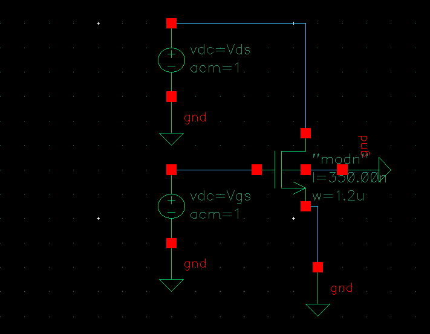
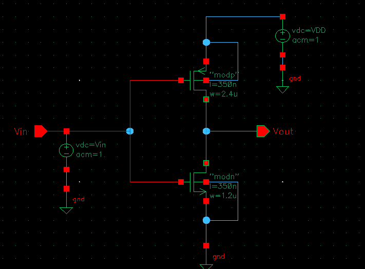

# Cadence Virtuoso — Analog IC Design Portfolio

VLSI analog circuit designs developed in Cadence Virtuoso using the AMS 0.35 µm (C35) PDK.
Simulations run via Spectre with BSIM3v3 device models on the University of Idaho ECE server.

---

## Technology

| Parameter | Value |
|---|---|
| PDK | AMS HIT-Kit 4.10 |
| Process | 0.35 µm CMOS (C35B4) |
| Tool | Cadence Virtuoso IC617 |
| Simulator | Spectre |
| Models | BSIM3v3 (`cmos53.scs`, section `cmostm`) |

---

## Module 01 — Device Characterization & CMOS Fundamentals

### NMOS I-V Characterization (`NMOS_iv`)

[Analysis](module01/NMOS_iv/analysis.md)

- W = 1.2 µm, L = 350 nm, W/L = 3.43 (AMS C35B4, `modn`)
- DC sweep: Id vs Vds family of curves (Vgs parametric)
- Vth extraction via constant-current method: **Vth = 0.523 V** (spec: 0.5 V ± 0.1 V)
- Confirmed correct PDK loading and BSIM3v3 model behavior

### CMOS Inverter VTC (`CMOS_inverter`)

[Analysis](module01/CMOS_inverter/analysis.md)

- NMOS: `modn` W = 1.2 µm / PMOS: `modp` W = 2.4 µm, L = 350 nm, VDD = 3.3 V
- PMOS sized 2× for equal drive strength (mobility compensation)
- Vin swept 0 → 3.3 V, Vm extracted at Vout = Vin intersection

| Parameter | Value | Description |
|-----------|-------|-------------|
| Vm | 1.511 V | Switching threshold |
| Voh | 3.298 V | Output high |
| Vol | 2.936 mV | Output low |
| Vil | 1.223 V | Input low threshold |
| Vih | 1.716 V | Input high threshold |
| NMH | 1.582 V | High noise margin |
| NML | 1.220 V | Low noise margin |

Vm is 139 mV below VDD/2 (1.65 V ideal), consistent with AMS C35 electron/hole mobility ratio deviating from the 2× sizing assumption under BSIM3v3 short-channel effects.

---

