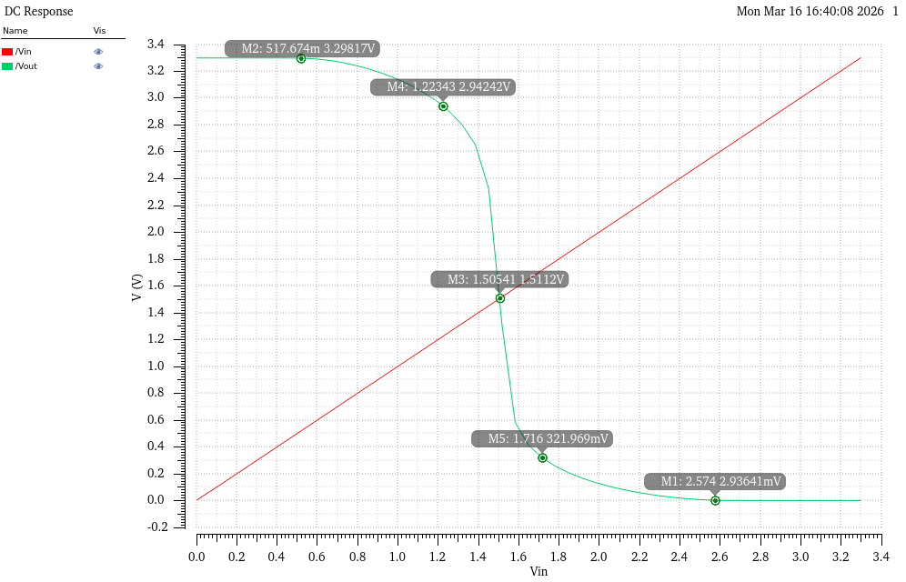

# Module 01 — CMOS Inverter Voltage Transfer Characteristic
## AMS C35 350nm, BSIM3v3, Cadence Spectre

---

## Device Parameters
- NMOS: modn, W = 1.2um, L = 350nm
- PMOS: modp, W = 2.4um, L = 350nm
- PMOS sized 2x NMOS width to compensate lower hole mobility
- VDD = 3.3V, NMOS bulk = GND, PMOS bulk = VDD

---

## Schematic


---

## Simulation — Voltage Transfer Characteristic



- Vin swept 0 to 3.3V, step 10mV
- Vout and Vin overlaid — intersection gives Vm visually

---

## Extracted Values

| Parameter | Value | Description |
|-----------|-------|-------------|
| Voh | 3.298V | Output high voltage |
| Vol | 2.936mV | Output low voltage |
| Vil | 1.223V | Input low threshold (transition begins) |
| Vih | 1.716V | Input high threshold (transition ends) |
| Vm | 1.511V | Switching threshold (Vout = Vin) |
| NMH | 1.582V | High noise margin = Voh - Vih |
| NML | 1.220V | Low noise margin = Vil - Vol |

---

## Hand Calculation — Switching Threshold Vm

For a CMOS inverter with equal drive strength (kn = kp):
```
Vm = VDD/2 = 1.65V (ideal, equal sizing)
```

With BSIM3v3 short channel effects and actual AMS C35 mobility ratio:
```
Simulated Vm = 1.511V
```

The 140mV offset below VDD/2 indicates the inverter is slightly NMOS-dominant.
The actual electron/hole mobility ratio in AMS C35 is not exactly 2x, and
short channel effects in BSIM3v3 shift the threshold below the ideal prediction.

---

## Noise Margin Analysis
```
NMH = Voh - Vih = 3.298 - 1.716 = 1.582V
NML = Vil - Vol = 1.223 - 0.003 = 1.220V
```

NMH > NML is consistent with Vm < VDD/2 — the inverter favors high output
stability over low output stability. Both noise margins exceed 1.2V which is
strong for a 3.3V process.

---

## Reproducible Netlist

Full Spectre netlist as-run: [input_netlist.txt](netlist/input_netlist.txt)

---

## PDK Setup Notes
- PMOS model: modp (AMS C35B4, same cmos53.scs section=cmostm)
- modp=1 flag confirmed in C35B4C0.scs processOption file
- PMOS bulk must connect to VDD, not GND — body diode must stay reverse biased
- Same three-file ADE model library setup as NMOS_iv applies here
