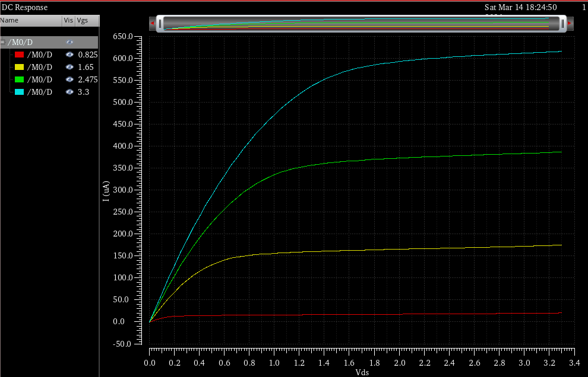
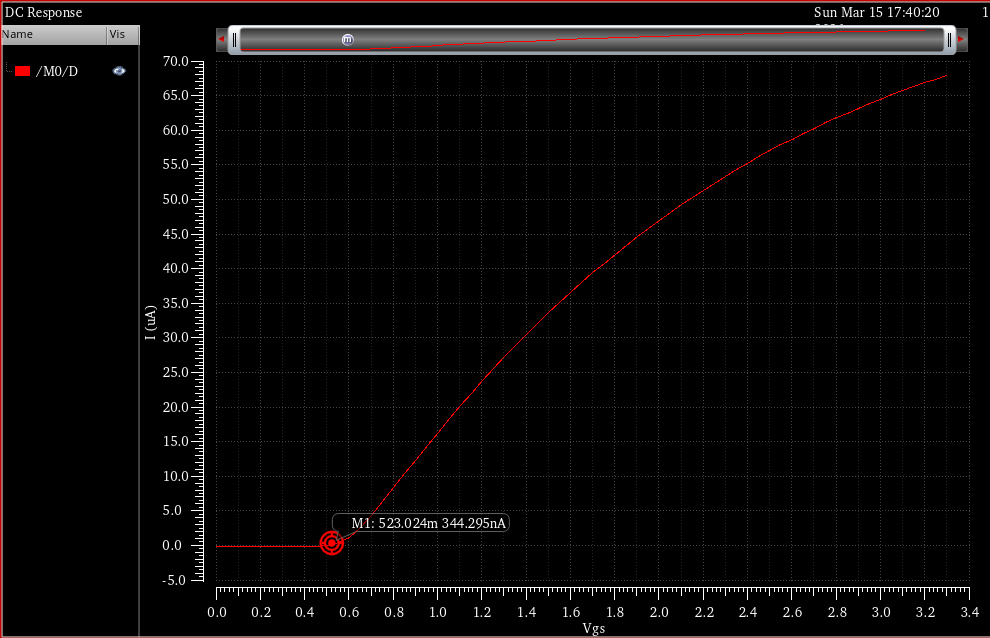

# Module 01 — NMOS I-V Characterization
## AMS C35 350nm, BSIM3v3, Cadence Spectre

---

## Device Parameters
- Model: modn (AMS C35B4 process)
- W = 1.2um, L = 350nm, W/L = 3.43
- VDD = 3.3V, Bulk = 0V (grounded)

---

## Schematic

---

## Simulation 1 — Id vs Vds Family of Curves

- Vds swept 0 to 3.3V, step 50mV
- Parametric: Vgs = 0.825, 1.65, 2.475, 3.3V

### Observations
- Triode region (Vds < Vgs - Vth): Id scales linearly with Vds
- Saturation region (Vds > Vgs - Vth): Id approximately constant
- Slight upward slope in saturation confirms channel length modulation
- Higher Vgs curves produce higher saturation current, consistent with:
  Id = (1/2) * un * Cox * (W/L) * (Vgs - Vth)^2

---

## Simulation 2 — Vth Extraction

- Method: Constant current method
- Bias: Vds = 100mV (linear region), Vgs swept 0 to 3.3V
- Id threshold = 100nA x W/L = 100nA x 3.43 = 343nA
- Result: Vth = 0.523V at Id = 343nA

### Verification
- AMS C35 datasheet typical NMOS Vth = 0.5V +/- 0.1V
- Measured 0.523V is within spec, confirming correct PDK loading

---

## Reproducible Netlist

Full Spectre netlist as-run: [input_netlist.txt](netlist/input_netlist.txt)

---

## PDK Setup Notes
Three model library files required in ADE L in this order:

1. `/tools.new/examples/pdk/ams035/spectre/c35/process.scs`
2. `/tools.new/examples/pdk/ams035/spectre/c35/processOption/C35B4C0.scs`
3. `/tools.new/examples/pdk/ams035/spectre/c35/cmos53.scs` — section=cmostm

### Key Findings
- Instantiable device subckt is `modn`, not `mosinsub`
- `mosinsub` is the raw BSIM3v3 model card called internally by `modn`
- `modn=1` process flag is set by `C35B4C0.scs`, not `cmos53.scs`
- Without `process.scs` and `C35B4C0.scs` loaded first, Spectre throws SFE-2001
- `analogLib nmos4` requires `model`, `w`, and `l` set explicitly on the instance
- SSH git operations on university server require `LD_LIBRARY_PATH=""` prefix
  due to Cadence OpenSSL library conflict — resolved via bashrc alias