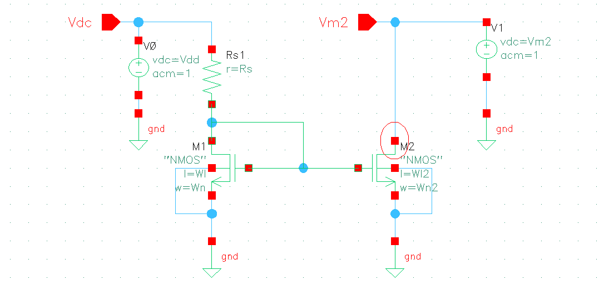
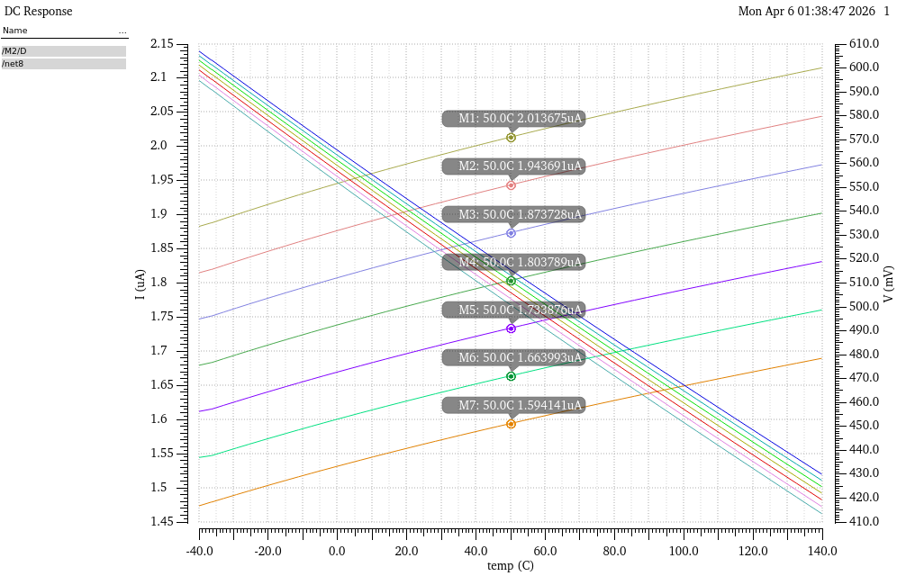
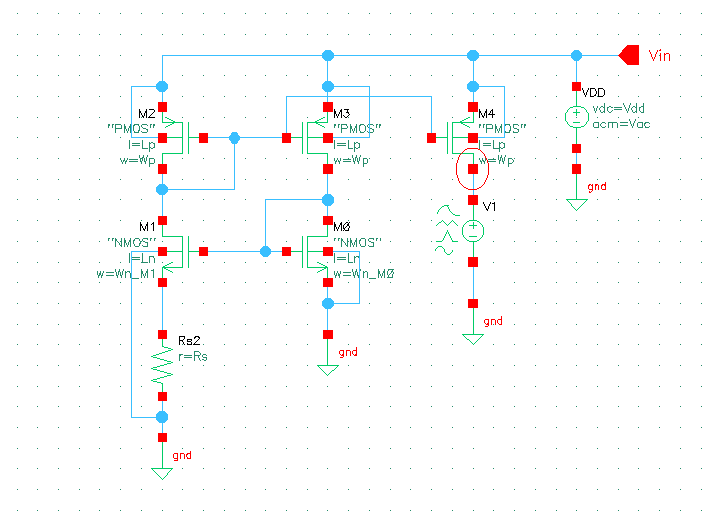
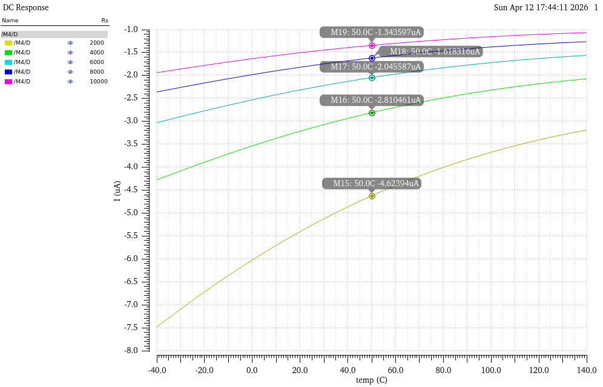
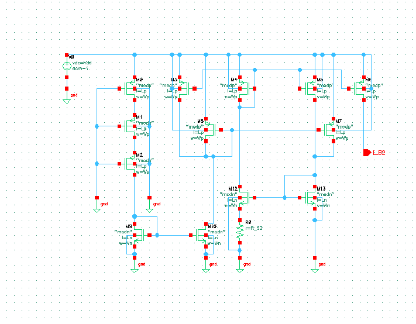
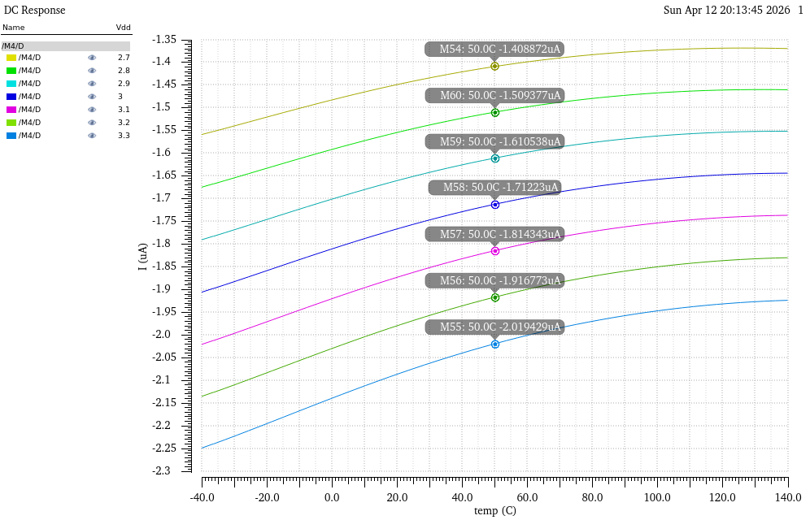
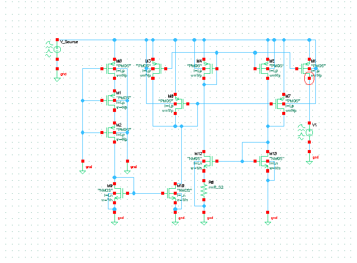
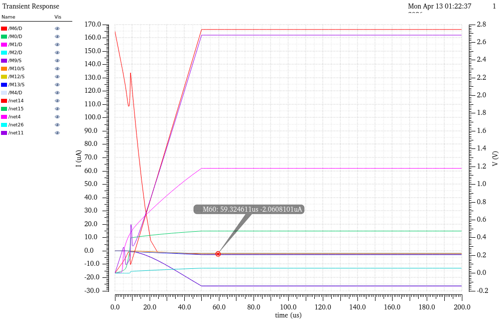

# Current source design

Author: Reynaldo Gomez
Cadence Repo: current source design

---

Four current source structures designed and simulated in PTM 180 nm CMOS. Target: IB = 2 µA at VDD = 3.3 V, T = 50°C, TT corner. PVT sweep: −40°C to 140°C, VDD 2.7–3.3 V, SS/TT/FF corners. Simulator: Cadence Virtuoso Spectre, BSIM3v3 Level 49.

---

## Structure

```
module_current_source/
├── simple_current_source/
├── self_biasing_current_source/
├── self_biasing_current_source_cascode_stage/
├── self_biasing_current_source_startup/
└── netlists/
```

---

## Technology and model setup

The SS/FF corners shift NMOS Vth0 by ±50 mV and U0 by ±15% from the TT nominal; these two parameters drive all process variation observed across the four circuits.

| Parameter | SS | TT | FF |
|-----------|----|----|-----|
| NMOS Vth0 (V) | 0.45 | 0.3999 | 0.35 |
| NMOS U0 (m²/V·s) | 3.0×10⁻² | 3.5×10⁻² | 4.0×10⁻² |
| NMOS Tox (nm) | 4.5 | 4.0 | 3.5 |
| PMOS Vth0 (V) | −0.47 | −0.42 | −0.37 |
| PMOS U0 (m²/V·s) | 6.5×10⁻³ | 8.0×10⁻³ | 9.5×10⁻³ |

N-well resistor `rnwod`: Rsh = 1 kΩ/sq, TC1 = 3.9×10⁻³ /°C, TC2 = 4.2×10⁻⁶ /°C².

---

## Circuit 1 — simple current source

RS1 = 1.35 MΩ sets Iref = 2 µA. M1 (diode-connected NMOS) establishes VGS for the reference branch; M2 mirrors that current to the output at 1:1. Both transistors: W = 1 µm, L = 500 nm.

$$
I_{ref} = \frac{V_{DD} - V_{GS,M1}}{R_{S1}}
$$

With VDD = 3.3 V and VGS,M1 = 0.6 V: Iref = (3.3 − 0.6) / 1.35 MΩ = 2.0 µA. At T = 50°C, VGS,M1 self-adjusts to 515 mV, giving Iref = (3.3 − 0.515) / 1.35 MΩ = 2.06 µA.



Vth reduction with temperature dominates over mobility degradation in this topology, producing a positive temperature coefficient across all corners. The diode-connected M1 partially self-compensates (VGS drops from 600 mV at 27°C to 515 mV at 50°C), but the compensation is incomplete, leaving a residual positive slope in IB1 across the full −40°C to 140°C range.



| Corner | IB1 at VDD = 3.3 V, T = 50°C | Deviation from TT |
|--------|-------------------------------|-------------------|
| FF | 2.081 µA | +3.4% |
| TT | 2.013 µA | baseline |
| SS | 1.950 µA | −3.1% |

The ±5% corner spread traces directly to the ±50 mV Vth0 shift and ±15% U0 shift in the corner model cards. Supply sensitivity is 0.42 µA over 2.7–3.3 V because RS1 is fixed: any change in VDD directly modulates the drop across RS1.

---

## Circuit 2 — self-biasing gm current source

The PMOS mirror (M3, M4, M7) forces equal current through two NMOS branches. M5 carries RS2 source degeneration; M6 sources directly to GND. The operating point depends on gm5 and RS2 only, not on VDD:

$$
I_{ref} = \frac{1}{2\, g_{m5}\, R_{S2}}
$$

With gm5 = 69.5 µS and RS2 = 6 kΩ: Iref = 1 / (2 × 69.5×10⁻⁶ × 6×10³) = 1.20 µA by long-channel estimate. BSIM3v3 velocity saturation compresses the effective VGS difference between M5 and M6, shifting the simulated operating point to IB2 = 2.045 µA at TT.



Note — zero-current degenerate state: the self-biasing topology has two mathematically valid DC solutions: the desired 2 µA state and a zero-current state. A `nodeset` statement is required to select the correct solution. No error is raised if it is omitted; the simulation silently converges to zero current.

```
nodeset net6=2.7 net7=0.6 net13=0.3
```

Unlike Circuit 1, this topology has a negative temperature coefficient: Iref ∝ gm² ∝ µn², and µn falls faster with temperature than Vth falls. RS2 cannot be fixed to simultaneously achieve 2 µA across all corners; the 5× spread from SS to FF is a fundamental limitation.



| Corner | RS2 for IB2 = 2 µA | Ratio to TT |
|--------|---------------------|-------------|
| FF | ≈10 kΩ | 1.67× |
| TT | 6 kΩ | 1× |
| SS | ≈2 kΩ | 0.33× |

Note — negative sign on IB2: Spectre reports PMOS drain current as negative by convention. Magnitudes are stated below.

| Corner | \|IB2\| at VDD = 3.3 V, T = 50°C | Deviation from TT |
|--------|-----------------------------------|-------------------|
| FF | 1.989 µA | −2.8% |
| TT | 2.045 µA | baseline |
| SS | 1.019 µA | −50.2% |

The SS deviation of −50.2% traces to the Iref ∝ gm² dependence: SS reduces U0 by 14% (3.0 vs. 3.5 ×10⁻² m²/V·s), which approximately halves gm² and therefore halves Iref.

---

## Circuit 3 — self-biasing gm with cascode stage

Circuit 2 with cascode devices added to both PMOS and NMOS branches, raising Rout from ≈ro to:

$$
R_{out,cascode} \approx g_{m,cas} \cdot r_{o,cas} \cdot r_{o,mir}
$$

At I = 2 µA, L = 1 µm: ro = L / (Pclm × I) = 1 µm / (0.05 × 2 µA) = 10 MΩ. Rout,cascode ≈ 69.5 µS × (10 MΩ)² ≈ 6.95 GΩ. The high output resistance produces the nearly flat IB3 vs. temperature curves observed across all corners.



Four independently sized transistor regions; regional width tuning reduces cascode VGS drops without disturbing the gm–RS3 operating point.

| Region | W / L |
|--------|-------|
| PMOS cascode top M0–M3 | 8 µm / 1 µm |
| PMOS mirror bottom M4–M8 | 8 µm / 1 µm |
| NMOS cascode M9–M12 | 6 µm / 1 µm |
| NMOS gm core M13–M15 | 4 µm / 1 µm |
| RS3 | 6.8 kΩ |

Temperature stability improves 9× over Circuits 1 and 2. The gm–RS3 condition IB3·RS3 = VGS,M13 − VGS,M14 depends on a matched difference: temperature effects on Vth and mobility cancel to first order, leaving ≈5% variation from −40°C to 140°C.



| Corner | \|IB3\| at VDD = 3.3 V, T = 50°C | Deviation from TT |
|--------|-----------------------------------|-------------------|
| FF | 2.022 µA | +0.15% |
| TT | 2.019 µA | baseline |
| SS | 2.029 µA | +0.49% |

SS deviation drops from −50.2% (Circuit 2) to +0.49% (Circuit 3). The high Rout makes the operating point insensitive to the device-level parameter variation that drove corner spread in Circuit 2.

---

## Circuit 4 — self-biasing gm with start-up circuit

Circuit 2 base topology with M29–M36 added to resolve the zero-current degenerate state at power-on. The PMOS injection stack (M0/M1/M2, gates tied to GND) conducts with Vsg = VDD ≫ |Vth,p| at startup, injecting kickstart current into the main NMOS reference branch. As IB2 builds, the shutdown detection branch (M8 diode-connected PMOS + M10 NMOS mirror) raises the injection node voltage, reducing the start-up contribution to zero at steady state.

Simulation: PWL VDD 0 V → 3.3 V over 50 µs; transient stop = 200 µs, step = 10 ns.





---

## Cross-design summary

The cascode stage is the decisive improvement across all three PVT axes. Temperature swing drops from 45% to 5%, SS deviation drops from −50.2% to +0.49%, and VDD spread drops from 1.35 µA to 0.61 µA.

| Metric | Circuit 1 | Circuit 2 | Circuit 3 |
|--------|-----------|-----------|-----------|
| IB at TT, 3.3 V, 50°C | 2.013 µA | 2.045 µA | 2.019 µA |
| Temp swing −40 to 140°C | 45% | 45% | 5% |
| VDD spread 2.7–3.3 V | 1.35 µA | 1.35 µA | 0.61 µA |
| SS deviation from TT | −3.1% | −50.2% | +0.49% |
| FF deviation from TT | +3.4% | −2.8% | +0.15% |

---

## Netlists

| File | Circuit |
|------|---------|
| `simple_current_source.scs` | 1 |
| `self_biasing_gm.scs` | 2 |
| `cascode_stage.scs` | 3 |
| `startup_circuit.scs` | 4 |
